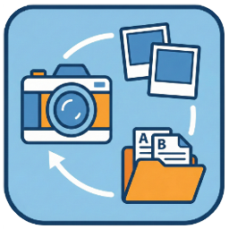

# Camera File Classifier 📷

相機檔案分類工具 - 自動將相機中的 RAW、JPG、HEIC、影片檔案分類到不同資料夾

<p align="center">
  
</p>

## ✨ 功能特色

- 🎯 **智能分類**：自動識別並分類 RAW、JPG、HEIC、影片等多種格式
- 📅 **日期篩選**：支援按日期範圍篩選檔案
- 🔄 **重複處理**：彈性處理同名檔案（跳過、覆蓋、重新命名）
- 🌍 **多語言支援**：支援繁體中文、簡體中文、英文
- 🖥️ **圖形介面**：直觀易用的圖形化操作介面
- ⚡ **快速啟動**：優化的打包方式，啟動速度快

## 📥 下載

前往 [Releases](https://github.com/YOUR_USERNAME/camera-file-classifier/releases/latest) 頁面下載最新版本。

### 安裝版（推薦）
適合一般用戶，包含完整的安裝向導和桌面快捷方式。

📦 **CameraFileClassifier_Setup_v1.0.0.exe** (約 10 MB)

**安裝步驟：**
1. 下載安裝程式
2. 雙擊執行
3. 按照安裝向導完成安裝
4. 從開始菜單或桌面快捷方式啟動

### 便攜版
無需安裝，解壓即用。適合需要在不同電腦上使用的用戶。

📦 **CameraFileClassifier_Portable_v1.0.0.zip** (約 15 MB)

**使用步驟：**
1. 下載壓縮檔
2. 解壓縮到任意位置
3. 執行 `CameraFileClassifier.exe`

## 📖 使用說明

### 基本操作

1. **選擇來源資料夾**
   - 點擊「瀏覽」選擇包含相機檔案的資料夾
   - 例如：記憶卡路徑、相機下載資料夾

2. **選擇目標資料夾**
   - 點擊「瀏覽」選擇分類後檔案的存放位置
   - 建議選擇有足夠空間的硬碟

3. **設定篩選條件**（可選）
   - **檔案類型**：
     - 全部：處理所有支援的檔案
     - 僅照片：只處理照片檔案（RAW、JPG、HEIC）
     - 僅影片：只處理影片檔案
   - **日期範圍**：
     - 起始日期：設定最早的拍攝日期
     - 結束日期：設定最晚的拍攝日期

4. **掃描檔案**
   - 點擊「掃描」按鈕
   - 查看將要處理的檔案清單

5. **開始分類**
   - 確認無誤後點擊「開始複製」
   - 等待處理完成

### 重複檔案處理

當目標資料夾中存在同名檔案時，系統會詢問您如何處理：

- **跳過**：保留現有檔案，不複製新檔案
- **覆蓋**：用新檔案覆蓋現有檔案
- **重新命名**：自動為新檔案加上編號（例如：photo_1.jpg）
- **全部套用**：對所有重複檔案使用相同的處理方式

## 🎨 支援的檔案格式

### 照片格式
| 格式 | 副檔名 | 說明 |
|------|--------|------|
| RAW | CR2, CR3, NEF, ARW, DNG, RAF, ORF, RW2 | 各廠牌相機的原始檔案格式 |
| JPEG | JPG, JPEG | 標準壓縮照片格式 |
| HEIC | HEIC | iPhone 等設備的高效圖片格式 |

### 影片格式
| 格式 | 副檔名 | 說明 |
|------|--------|------|
| MP4 | MP4 | 最常見的影片格式 |
| MOV | MOV | Apple 裝置常用格式 |
| AVI | AVI | 傳統影片格式 |
| MKV | MKV | 高清影片格式 |
| M4V | M4V | iTunes 影片格式 |

## 🔧 系統需求

- **作業系統**：Windows 10 或更新版本
- **硬碟空間**：至少 50 MB（安裝版）或 20 MB（便攜版）
- **記憶體**：建議 2 GB 以上
- **螢幕解析度**：建議 1280x720 以上

## ❓ 常見問題

### Q: 圖標顯示有白邊怎麼辦？
A: 這是 Windows 圖標快取的問題。請嘗試：
1. 執行 `clear_icon_cache.bat`
2. 或重新啟動電腦

### Q: 啟動速度很慢怎麼辦？
A:
- 使用便攜版（onedir）而非單檔版
- 將程式加入防毒軟體白名單
- 確保硬碟有足夠空間

### Q: 可以同時處理多個資料夾嗎？
A: 目前版本僅支援單一來源資料夾，未來版本將加入此功能。

### Q: 處理大量檔案時會不會很慢？
A: 程式已經過優化，處理速度主要取決於：
- 檔案數量和大小
- 硬碟讀寫速度
- 是否需要重新命名

## 🐛 問題回報

如果遇到任何問題或有功能建議，請在 [Issues](https://github.com/YOUR_USERNAME/camera-file-classifier/issues) 頁面提交。

提交問題時請包含：
- Windows 版本
- 錯誤訊息截圖
- 操作步驟描述

## 📝 更新日誌

### v1.0.0 (2024-12-17)
- ✨ 首次發布
- 🎯 支援 RAW、JPG、HEIC、影片格式分類
- 📅 日期篩選功能
- 🌍 多語言支援（繁中、簡中、英文）
- 🔄 重複檔案處理選項

## 🛠️ 開發者資訊

### 環境需求
- Python 3.12+
- Windows 10/11

### 安裝依賴
```bash
pip install -r requirements.txt
```

### 執行開發版
```bash
python main.py
```

### 打包說明

詳細打包說明請參閱 [BUILD_INSTALLER_README.md](BUILD_INSTALLER_README.md)

**快速打包：**
```bash
prepare_release.bat
```

這會自動生成：
- `releases/CameraFileClassifier_Portable_v1.0.0.zip`（便攜版）
- `releases/CameraFileClassifier_Setup_v1.0.0.exe`（安裝版）

## 📄 授權

本專案採用 **CC BY-NC 4.0**（姓名標示-非商業性）授權條款。

您可以自由使用、修改和分享本軟體，但**不得用於商業用途**。

詳見 [LICENSE](LICENSE) 文件。


## 📧 聯絡方式

- GitHub Issues: [提交問題](https://github.com/kaikaichumi/camera-file-classifier/issues)
- Email: karta2398980@gmail.com

---

**如果這個工具對您有幫助，請給個 ⭐ Star 支持一下！**
